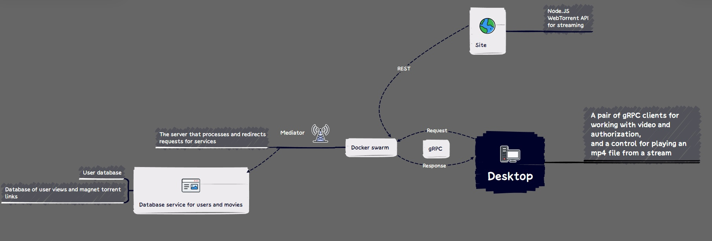
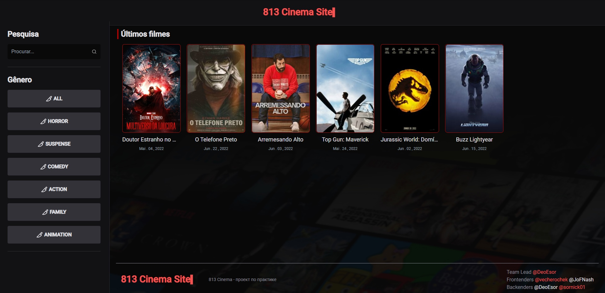
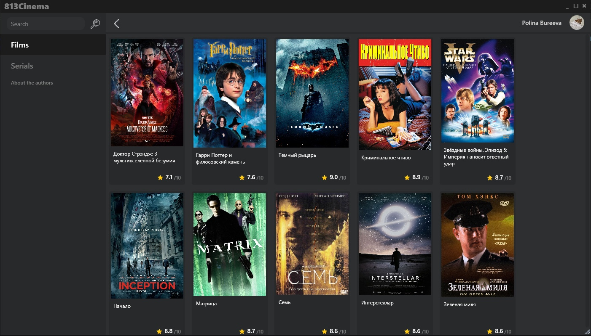
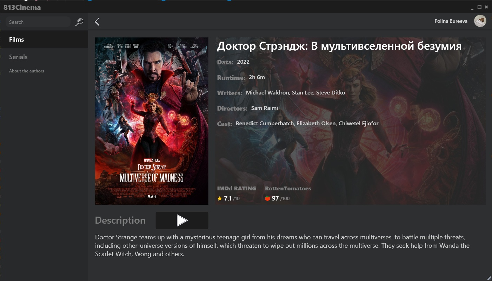

# OnlineCinema
Just another pet project

## Architecture

## Contributors
[Valeriy Vartumyan - Team Lead, Backend, Prototyping, Software Architect(LOL)](github.com/DeoEsor)

[Polina Bureeva - Frontend(WPF)](https://github.com/vecherochek)

[Nikita Sorokin - Backend, Prototyping](https://github.com/sornick01)

[Olia Lozhkina - Frontend, Design, Prototyping](https://github.com/JoFNash)

## Tech stack

gRPC, ASP.NET + Entity Framework, .NET Core 5, WPF, React, TypeScript

## Screenshots

## Progress

https://trello.com/b/jsRJQlN4/онлайн-кинотеатр
